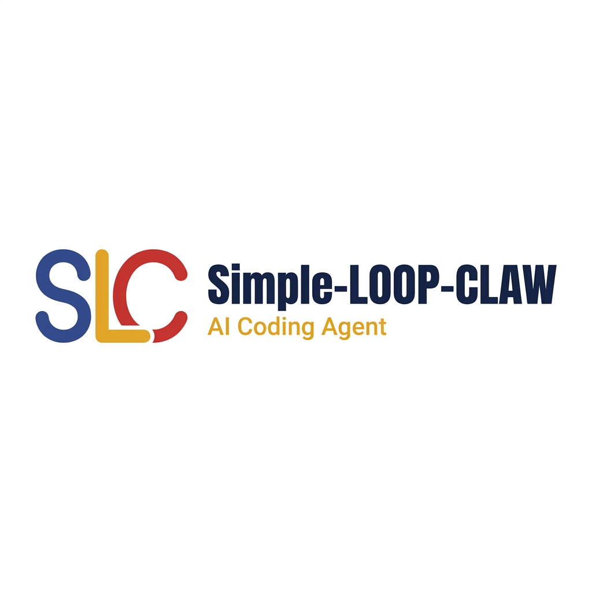

# Simple-LOOP-CLAW

<p align="center">
  
</p>

<div align="center">

[](LICENSE)
[](https://github.com/JUSTICEKB/JUSTICEKB-Simple-LOOP-CLAW)
[](#stack)

</div>

Simple-LOOP-CLAW is a local AI Coding Agent workbench with a CLI, local API server, Electron desktop app, model-provider presets, and IM adapters. It brings sessions, file edits, permission gates, scheduled tasks, and provider configuration into one visual workflow.

> Important: This repository is for learning, research, and local technical experiments. Follow the terms of every model, OAuth, IM, and automation provider you connect, and protect your API keys, tokens, and local data.

## Brand

The project now uses the local `docs/images/app-icon.png` and `docs/images/banner.png` assets consistently. README screenshots and logos are local repository assets, not remote GitHub screenshots or legacy branding.

| Role | Color |
| --- | --- |
| Primary blue | `#334B89` |
| Accent gold | `#E7A72C` |
| Danger red | `#D13631` |

## Desktop Preview

These screenshots are repository-local desktop preview assets.

<table>
  <tr>
    <td align="center" width="50%"><br><b>Developer Workspace (Sessions & Files)</b></td>
    <td align="center" width="50%"><br><b>Visual Code Diff Viewer</b></td>
  </tr>
  <tr>
    <td align="center" width="50%"><br><b>Permission Gate</b></td>
    <td align="center" width="50%"><br><b>Usage & Scheduled Tasks</b></td>
  </tr>
</table>

## Highlights

- Local CLI and desktop workflow for sessions, terminals, file edits, and permission approvals.
- Provider presets for Claude Official, ChatGPT Official, DeepSeek, Kimi, MiniMax, Zhipu GLM, Google Gemini, local LM Studio / Ollama, and custom endpoints.
- Google Gemini uses the official OpenAI compatibility endpoint with `https://generativelanguage.googleapis.com/v1beta/openai`.
- Windows-friendly launcher: `bun run start` now dispatches to `bin/loop-claw.cmd` on Windows instead of asking Bun to parse the Bash launcher.
- IM adapters for Telegram, Feishu, WeChat, DingTalk, and related remote workflows.

## Stack

- Runtime: Bun, Node.js 22+
- CLI / Server: TypeScript, Ink, WebSocket, local REST API
- Desktop: Electron, React, Vite, Vitest
- Docs: VitePress

## Quick Start

```powershell
bun install
bun run start -- --help
```

Start the local API server:

```powershell
$env:SERVER_PORT = "3456"
bun run src/server/index.ts
```

Start the desktop frontend:

```powershell
cd desktop
bun install
bun run dev
```

The desktop Vite app defaults to `http://127.0.0.1:1420`, and the API server defaults to `http://127.0.0.1:3456`.

## Gemini Provider

Open Settings -> Providers in the desktop app and choose the Google Gemini preset:

- API key: create one in [Google AI Studio](https://aistudio.google.com/app/apikey).
- Base URL: `https://generativelanguage.googleapis.com/v1beta/openai`
- API format: `openai_chat`
- Default model: `gemini-3.5-flash`
- Lightweight model: `gemini-3.1-flash-lite`

Run the provider test before activating it for sessions.

## Links

- [中文 README](README.md)
- [Desktop docs](docs/desktop/)
- [Third-party model guide](docs/guide/third-party-models.md)
- [IM adapter docs](docs/im/)
- [Contributing](CONTRIBUTING.md)
