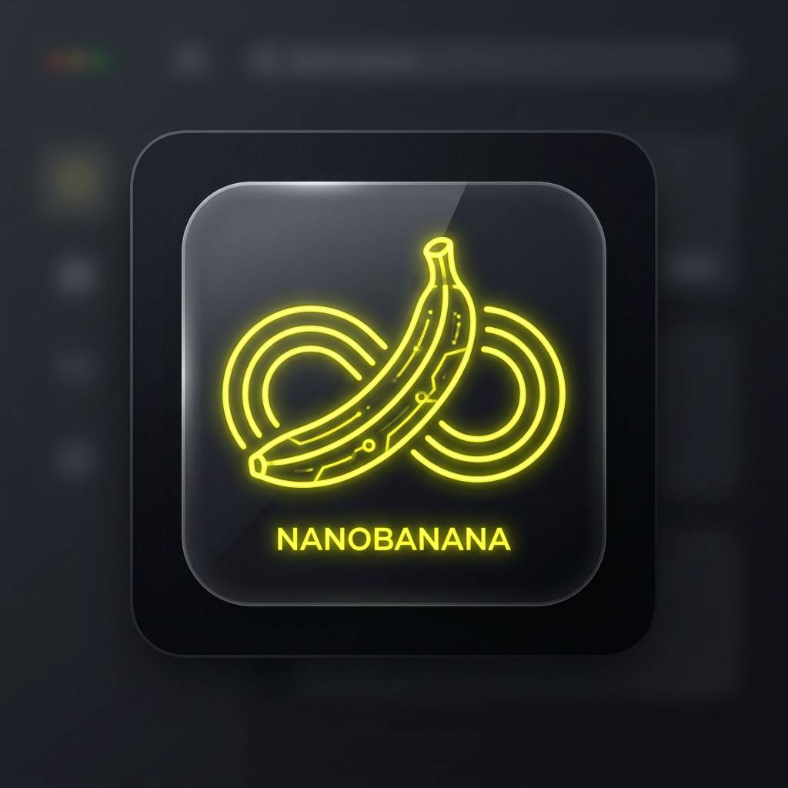
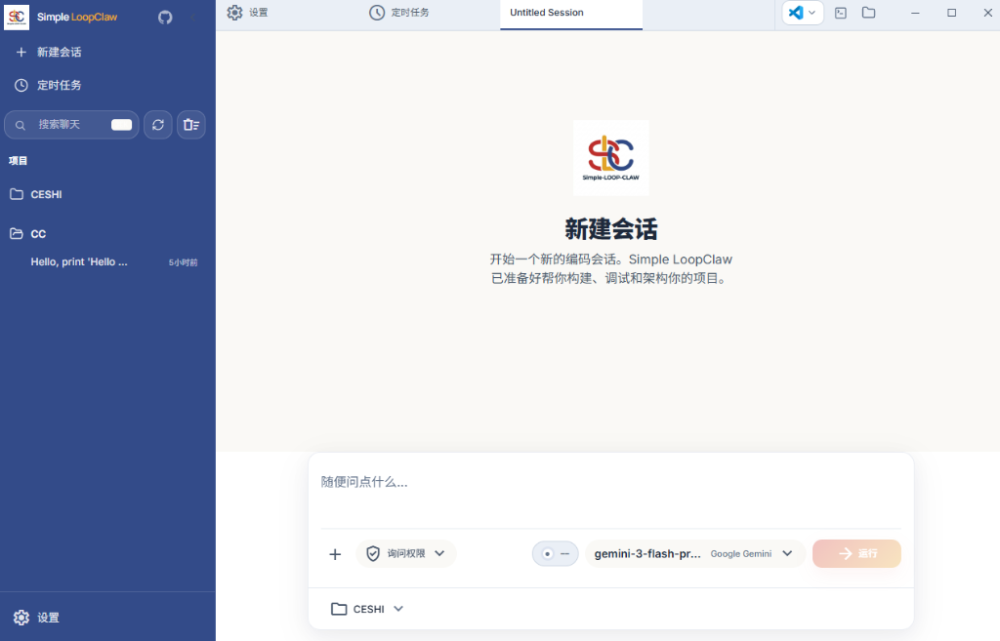
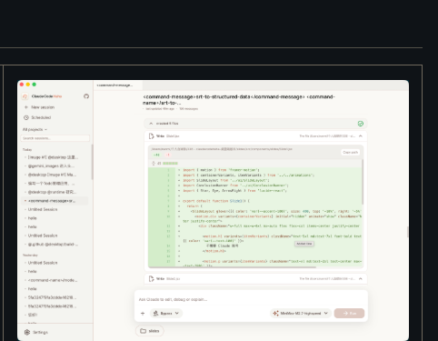
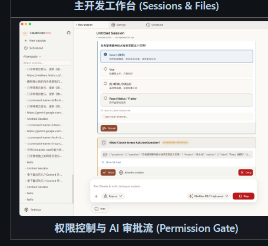
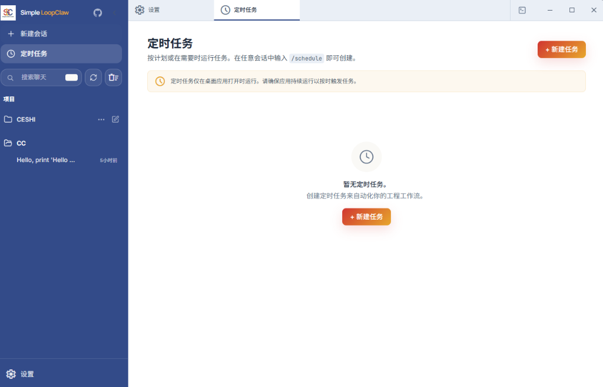

# Simple LoopClaw (Simple-LOOP-CLAW)

<p align="center">
  
</p>

<div align="center">

[](LICENSE)
[](https://github.com/JUSTICEKB/JUSTICEKB-Simple-LOOP-CLAW)
[](#)
[](#)

</div>

---

> [!WARNING]
> ### ⚠️ CRITICAL DISCLAIMER / 重要免责声明
> 
> **ENGLISH:**
> This repository is based on the source code of **Claude Code** leaked from the Anthropic npm registry on 2026-03-31. All original source code copyrights belong exclusively to **Anthropic**. This repository and its modified versions are provided **strictly for educational, study, and research purposes only**. Commercial use, distribution, or resale of this software is strictly prohibited. Use at your own risk.
>
> **中文:**
> 本仓库基于 2026-03-31 从 Anthropic npm registry 泄露的 **Claude Code** 原始源码进行修复、重构与优化。所有原始源码的版权及相关权利完全归 **Anthropic** 所有。本仓库及改造后的版本**仅供学术研究、个人学习和技术交流之用**。严禁将本软件用于任何商业用途、非法用途或与官方产品进行恶意竞争。使用本软件产生的所有法律后果与风险均由使用者自行承担。

---

## 💡 项目背景与设计初衷

**Simple LoopClaw** 是一个致力于降低 AI 辅助编程门槛、为个人开发者打造的本地 **AI Agent 协同与工作流编排工作台**。

项目结合了社区最优秀的两个开源实践（`cc-haha` 与 `Qclaw`）并进行了系统性的功能升级与架构改造：
1. **底座升级 (来自 `cc-haha`)**：支持全功能的本地 AI 编程引擎（CLI 交互）、支持自定义 MCP（Model Context Protocol）工具集，并且提供了一个基于 Electron + React 构建的精致桌面 IDE 协同工作台。
2. **极简精神 (来自 `Qclaw`)**：
   - 彻底优化了环境检测逻辑，大幅降低小白用户的配置成本。
   - 新增了 **Windows 专属快捷启动器** (`bin/loop-claw.cmd`)，让 Windows 开发者免受 WSL 或 Bash 环境的繁琐配置之苦。
   - 整理并集成了包括飞书、钉钉、微信、QQ、Telegram、WhatsApp 在内的完备 **IM 渠道接入适配器**。
3. **前瞻性 AI IDE 设计**：我们不仅仅在做本地 CLI 工具，还在向**可视化 JSON 任务流编排 (JSON-driven workflows)**、**多智能体协同 (Multi-Agent team layout)** 以及 **IDE 插件模式** 进发，构建属于开发者个人的 AI IDE。

---

## 📸 桌面端预览 (Screenshots)

<table>
  <tr>
    <td align="center" width="50%"><br><b>主开发工作台 (Sessions & Files)</b></td>
    <td align="center" width="50%"><br><b>可视化代码对比与 Diff 视图</b></td>
  </tr>
  <tr>
    <td align="center" width="50%"><br><b>权限控制与 AI 审批流 (Permission Gate)</b></td>
    <td align="center" width="50%"><br><b>计划任务与用量统计面板 (Usage & Tasks)</b></td>
  </tr>
</table>

---

## 🚀 核心功能亮点

- 🖥️ **可视化开发面板**：在桌面应用中直接查看 AI 的每一步文件修改、执行的终端命令，并提供一键安全审批拦截（防止误删或泄露数据）。
- ⚙️ **多模型提供商 presets**：轻松配置并灵活切换 Anthropic API、OpenAI、DeepSeek、Ollama 以及 WebSearch fallback 本地自定义提供商。
- 🤖 **多平台 IM 机器人接入**：通过统一适配层，可让 Coding Agent 独立在即时通讯平台中工作。
- 🪟 **Windows 友好启动器**：通过专门定制的批处理脚本 `bin/loop-claw.cmd` 启动，无缝接入 CMD 和 PowerShell 终端。
- 🧩 **LSP / MCP 工具支持**：自带丰富的文件、系统、Shell 工具链，并支持集成任何 Model Context Protocol 协议的外部工具包。

---

## 🛠️ 快速上手指南

### 1. 运行环境要求
* **Node.js** >= 22 (推荐 Node.js 24)
* **Bun** (可选，调试 CLI 与运行测试)

### 2. 源码安装与 CLI 启动

#### Windows 平台
使用 Windows 专属快捷启动器：
```cmd
# 安装依赖
npm install

# 复制并配置环境变量
copy .env.example .env

# 运行 CLI
.\bin\loop-claw.cmd
```

#### macOS / Linux 平台
```bash
# 安装依赖
npm install

# 复制并配置环境变量
cp .env.example .env

# 赋予执行权限并启动
chmod +x ./bin/loop-claw
./bin/loop-claw
```

### 3. 运行可视化桌面端
编译并运行 Electron 桌面环境：
```bash
cd desktop
npm install
npm run dev
```

---

## 📁 快速资源导航 (Documentation & Guides)

为了让您能够更好地了解和参与项目，我们准备了以下核心资源：
- 📄 **学术研究免责声明与许可协议**：[LICENSE](LICENSE) (详细列出了使用本软件的版权声明和商业限制条款)。
- 🧭 **开发路线图**：[ROADMAP.md](ROADMAP.md) (关于可视化 JSON 任务流编排、MCP 插件中心以及 IDE 伴侣模式的发布日程)。
- 📋 **贡献指南**：[CONTRIBUTING.md](CONTRIBUTING.md) (详细说明了本地验证流程、覆盖率门槛以及 PR 质量门禁)。
- 📝 **历史版本变更**：[CHANGELOG.md](CHANGELOG.md) (记录了从 v0.1.0 到 v0.4.5 的所有演进细节)。
- 💬 **即时通讯接入指南**：详细配置指南可在 [docs/im/](docs/im/) 查看。
